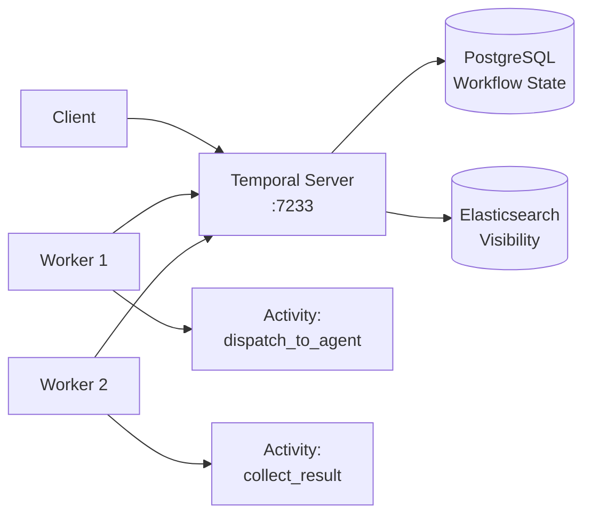
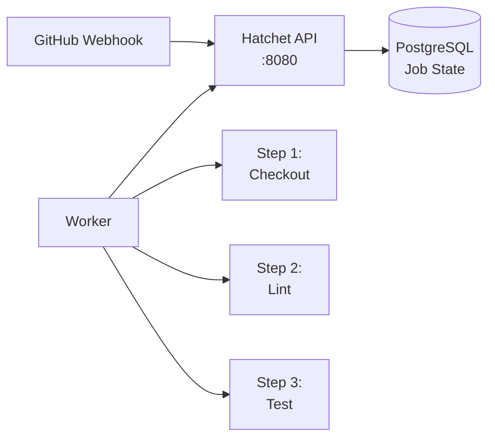

# WP11: Documentation and Runbooks

**Feature**: 008-temporal-deployment-workflow-migration
**Phase**: 5 - Handoff
**Wave**: 1
**Dependencies**: WP06 (traces), WP07 (dashboards), WP08 (rollback)
**Author**: Claude Sonnet 4.6

## Mission

Create all operational documentation for the Temporal + Hatchet infrastructure. Ensure every operational procedure has a runbook. Ensure every developer can understand the system without reading source code. Archive all legacy NATS workflow documentation.

## Reference

- Spec: `../spec.md` — FR-TEMPORAL-009
- Plan: `../plan.md` — WP11 section
- Depends on: `WP06-traces.md`, `WP07-slo-dashboards.md`, `WP08-rollback.md`

## Context

Documentation lives in `docs/infra/` of the main project repository. Each document below must be:
- Written in Markdown with Mermaid diagrams for architecture
- Linked from `docs/infra/README.md`
- Reviewed by a human operator before merge

## What to Build

### 1. `docs/infra/README.md` — Infrastructure Index

```markdown
# Infrastructure Documentation

## Overview

This directory contains operational documentation for all infrastructure services.

## Services

| Service | Purpose | Dashboard | Port |
|---------|---------|-----------|------|
| [Temporal](temporal/) | Durable workflow orchestration | https://temporal.internal | 8233 |
| [Hatchet](hatchet/) | Lightweight job scheduler | https://hatchet.internal | 8081 |
| [Jaeger](tracing/) | Distributed tracing | https://jaeger.internal | 16686 |
| [Grafana](monitoring/) | SLO dashboards | https://grafana.internal | 3000 |
| [Prometheus](monitoring/) | Metrics collection | - | 9090 |
| [NATS](nats/) | Pure event bus | - | 4222 |

## Workflow Engines

### Temporal (Primary)
- **Use for**: Long-running workflows, durable execution, saga patterns, exactly-once guarantees
- **Examples**: Agent dispatch, multi-step data pipelines, human-in-the-loop workflows
- **Docs**: [Temporal Overview](temporal/README.md)

### Hatchet (Secondary)
- **Use for**: CI triggers, cron jobs, lightweight event-driven steps
- **Examples**: GitHub webhook → CI pipeline, hourly health checks, scheduled syncs
- **Docs**: [Hatchet Overview](hatchet/README.md)

### NATS (Event Bus Only)
- **Use for**: At-most-once pub/sub, non-critical event propagation
- **Examples**: `events.*`, `agent.result.*`, `ci.status.*`
- **DO NOT use for**: Workflow dispatch, queue-based processing
- **Docs**: [NATS Role](nats/README.md)

## Runbooks

| Runbook | Trigger | SLA |
|---------|---------|-----|
| [Temporal Deployment](temporal/DEPLOY.md) | Initial deploy or major upgrade | 30 min |
| [Temporal Troubleshooting](temporal/TROUBLESHOOT.md) | Workflow stuck, latency spike | 15 min |
| [Workflow Authoring](temporal/AUTHORING.md) | Writing new workflows | - |
| [Rollback Procedure](rollback/PROCEDURE.md) | Critical failure | 10 min |
| [Hatchet Deployment](hatchet/DEPLOY.md) | Initial deploy or upgrade | 20 min |
| [Hatchet Authoring](hatchet/AUTHORING.md) | Writing new Hatchet workflows | - |
| [NATS Recovery](nats/RECOVERY.md) | NATS down, need event bus | 10 min |

## Architecture


## Quick Links

- [SLO Dashboard](https://grafana.internal/d/temporal-slos)
- [Workflow List](https://temporal.internal/namespaces/default/workflows)
- [Hatchet Dashboard](https://hatchet.internal)
- [Jaeger Traces](https://jaeger.internal)
```

### 2. `docs/infra/temporal/README.md` — Temporal Overview

```markdown
# Temporal: Durable Workflow Orchestration

## Overview

Temporal provides durable, exactly-once workflow execution. Workflows survive worker restarts, Temporal server restarts, and network partitions.

## Architecture



## Key Concepts

### Workflows
A Workflow is a durable function execution. It has:
- **Workflow ID**: Unique identifier (e.g., `agent-dispatch-{task_id}`)
- **Run ID**: Each execution of a workflow gets a new run ID
- **Task Queue**: Worker's subscription queue (default: `default`)

### Activities
An Activity is a single step executed by a worker:
- Heartbeat support for long-running steps
- Automatic retry with configurable backoff
- Timeout per activity and per attempt

### SLOs

| Metric | Target | Critical Threshold |
|--------|--------|-------------------|
| Completion Rate | > 99.9% | < 95% for 15 min |
| p99 Latency | < 5 min | > 10 min |
| Activity Retry Rate | < 1% | > 5% |

## Default Ports

| Port | Service | URL |
|------|---------|-----|
| 7233 | gRPC | temporal:7233 |
| 8233 | Frontend UI | https://temporal.internal |
| 9233 | Metrics | http://temporal:9233/metrics |
| 9200 | Elasticsearch | http://elasticsearch:9200 |

## Environment Variables

| Variable | Default | Purpose |
|----------|---------|---------|
| TEMPORAL_HOST | temporal:7233 | Temporal gRPC address |
| TEMPORAL_NAMESPACE | default | Workflow namespace |
| TEMPORAL_TASK_QUEUE | default | Default task queue |
| WORKFLOW_ENGINE | temporal | Dispatch routing (temporal/hatchet/nats) |

## Common Operations

### View Running Workflows
```bash
tctl workflow list
```

### Cancel a Stuck Workflow
```bash
tctl workflow cancel {workflow_id}
```

### Reset a Failed Workflow
```bash
tctl workflow reset --workflow_id {workflow_id} --reason "Manual reset after bug fix"
```

### View Workflow History
```bash
tctl workflow show {workflow_id}
```

## Health Check

```bash
curl http://localhost:8233/health
# Expected: {"status":"SERVING"}
```
```

### 3. `docs/infra/temporal/AUTHORING.md` — Workflow Authoring Guide

```markdown
# Temporal Workflow Authoring Guide

## Overview

This guide covers writing new Temporal workflows for the agent dispatch system.

## Workflow Structure

```rust
// 1. Define workflow input/output as structs
#[derive(Debug, Serialize, Deserialize)]
pub struct AgentDispatchInput {
    pub task_id: String,
    pub agent_type: String,
    pub prompt: String,
    pub context: HashMap<String, serde_json::Value>,
    pub timeout_seconds: u32,
}

// 2. Implement the workflow trait
#[derive(Debug, Clone)]
pub struct AgentDispatchWorkflow;

#[async_trait]
impl Workflow for AgentDispatchWorkflow {
    async fn execute(&self, ctx: &mut Context, input: AgentDispatchInput) -> Result<WorkflowResult, WorkflowError> {
        // Workflow logic here
    }
}
```

## Retry Policy

Default retry policy for activities:

```rust
RetryOptions::default()
    .with_initial_interval(Duration::from_secs(10))
    .with_backoff_coefficient(2.0)
    .with_maximum_interval(Duration::from_secs(600))
    .with_maximum_attempts(3)
    .with_non_retryable_errors(["ValidationError"])
```

## Heartbeat

For long-running activities (> 60s), emit heartbeats:

```rust
ctx.activity_mut().heartbeat("Processing step 3/10")?;
```

## Testing

```bash
# Run workflow locally
cargo test --package temporal-worker -- workflow_tests

# Integration test
cargo test --package temporal-worker --test workflow_integration
```

## Best Practices

1. **Idempotency**: Activities must be safe to retry
2. **Heartbeat**: For any activity > 60s, emit heartbeats
3. **Timeout**: Always set reasonable timeouts
4. **Saga**: Use compensation for distributed transactions
5. **Local activity**: For < 30s synchronous work, use `#[activity(local)]`
```

### 4. `docs/infra/temporal/TROUBLESHOOT.md` — Troubleshooting Guide

```markdown
# Temporal Troubleshooting Guide

## Workflow Stuck in "Running"

### Diagnosis

```bash
# Check workflow history
tctl workflow show {workflow_id} | grep -E "EventType|State"

# Check if activity is retrying
tctl workflow describe {workflow_id} | grep -A5 "PendingActivities"
```

### Resolution

1. **Activity timeout**: Increase timeout or fix the activity
2. **Worker disconnected**: Restart workers: `docker compose up -d temporal-worker`
3. **Temporal server issue**: Check Temporal health: `curl http://localhost:8233/health`
4. **Cancel and retry**: `tctl workflow cancel {workflow_id}`

## High Latency (p99 > 5 min)

### Diagnosis

```bash
# Check Jaeger for slow spans
curl "http://localhost:16686/api/traces?service=temporal-worker&limit=10" | jq '.data[].spans[] | select(.duration > 300000)'

# Check activity retry rate
curl -s http://localhost:9090/api/v1/query?query=temporal_activity_retries_total
```

### Resolution

1. **Activity retries**: Find failing activity, check logs: `docker logs temporal-worker`
2. **Elasticsearch slow**: Check disk I/O: `iostat -x 5`
3. **Worker overloaded**: Scale workers: increase `NUM_WORKERS` in docker-compose
4. **DB slow**: Check PostgreSQL connections: `docker exec temporal-postgres psql -U postgres -c "SELECT count(*) FROM pg_stat_activity WHERE datname='temporal';"`

## Workflow Failed

### Diagnosis

```bash
# View failure reason
tctl workflow show {workflow_id} | grep -A10 "EventTypeWorkflowExecutionFailed"

# Check worker logs for stack trace
docker logs temporal-worker --since=5m | grep -E "ERROR|panic"
```

### Common Causes

| Error | Cause | Fix |
|-------|-------|-----|
| `Activity task timeout` | Activity taking too long | Increase timeout or optimize activity |
| `Exceeded retry policy` | Activity failed after all retries | Fix activity bug, then reset workflow |
| `Panic in workflow` | Unhandled panic | Check worker logs, fix code, restart |
| `Non-deterministic error` | Workflow code changed | Do NOT update running workflows; cancel and restart |

## Reset vs Cancel

- **Cancel**: Ends the workflow immediately. Use for stuck/abort workflows.
- **Reset**: Erases history and restarts from the beginning. Use after fixing a bug in the workflow code.
```

### 5. `docs/infra/hatchet/README.md` — Hatchet Overview

```markdown
# Hatchet: Lightweight Job Scheduler

## Overview

Hatchet handles lightweight event-driven workflows: CI pipeline triggers, cron jobs, and step-based automation. It is NOT for long-running workflows — use Temporal for those.

## Architecture



## Use Cases

- **GitHub webhooks**: PR opened → Hatchet workflow → CI pipeline
- **Cron jobs**: Hourly health checks, daily data syncs
- **Event-driven steps**: Non-durable, fire-and-forget jobs

## Key Metrics

| Metric | Target |
|--------|--------|
| CI trigger time | < 30 seconds from webhook |
| Step success rate | > 99% |
| Failed job alert | Within 5 minutes |

## Environment Variables

| Variable | Default | Purpose |
|----------|---------|---------|
| HATCHET_API_URL | https://hatchet.internal | Hatchet API endpoint |
| HATCHET_DB_PASSWORD | (from .env) | PostgreSQL password |
```

### 6. `docs/infra/nats/README.md` — NATS Role

```markdown
# NATS: Pure Event Bus

## Role After Migration

NATS is configured as a **pure pub/sub event bus**. No workflow logic, no JetStream consumers, no durable queues.

## What NATS Does

- **Event propagation**: `events.*` subjects for application-wide events
- **Result notifications**: `agent.result.*`, `ci.status.*`
- **At-most-once delivery**: Subscribers get messages if connected

## What NATS Does NOT Do

- ❌ Workflow dispatch (→ Temporal)
- ❌ Queue-based processing (→ Temporal or Hatchet)
- ❌ Scheduled jobs (→ Hatchet cron)
- ❌ Long-running task handling (→ Temporal)

## Subjects

| Subject | Type | Purpose |
|---------|------|---------|
| `events.agent.*` | Pub/Sub | Agent lifecycle events |
| `events.ci.*` | Pub/Sub | CI pipeline events |
| `agent.result.*` | Pub/Sub | Agent completion results |
| `ci.status.*` | Pub/Sub | Pipeline status updates |
| `notifications.*` | Pub/Sub | User/system notifications |

## Guaranteed Delivery

NATS pub/sub is **at-most-once**. For guaranteed delivery:
- **Exactly-once, long-running**: Use Temporal
- **At-least-once, short-running**: Use Hatchet
- **At-most-once, fire-and-forget**: Use NATS

## Health Check

```bash
curl http://localhost:8222/healthz
# Expected: {"status":"ok"}

# Check connections
nats server info
```
```

## Acceptance Criteria

- [ ] `docs/infra/README.md` created with complete service index
- [ ] `docs/infra/temporal/README.md` covers architecture, ports, SLOs
- [ ] `docs/infra/temporal/DEPLOY.md` covers initial deploy and upgrade
- [ ] `docs/infra/temporal/AUTHORING.md` covers workflow authoring patterns
- [ ] `docs/infra/temporal/TROUBLESHOOT.md` covers common failure modes
- [ ] `docs/infra/hatchet/README.md` covers architecture and use cases
- [ ] `docs/infra/hatchet/DEPLOY.md` covers initial deploy
- [ ] `docs/infra/hatchet/AUTHORING.md` covers workflow authoring
- [ ] `docs/infra/nats/README.md` documents pure event bus role
- [ ] `docs/infra/rollback/PROCEDURE.md` links to WP08 ROLLBACK.md
- [ ] All documents linked from `docs/infra/README.md`
- [ ] Architecture diagram (Mermaid) embedded in README
- [ ] Legacy NATS JetStream documentation archived to `.archive/`
