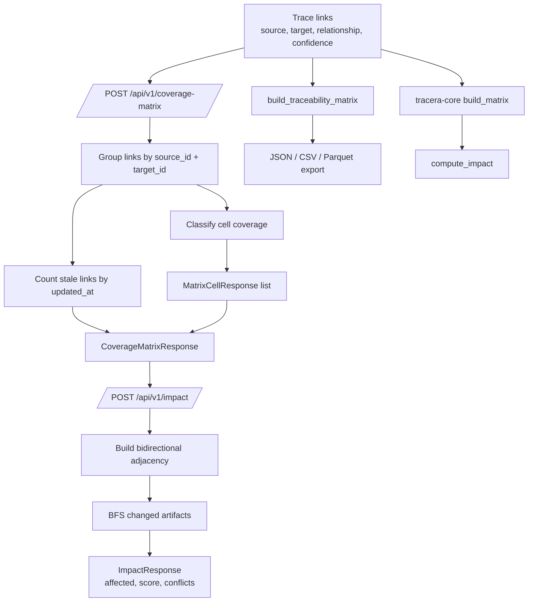

# Architecture

Tracera keeps traceability data in a small set of canonical shapes: trace links,
coverage matrix cells, impact reports, governance reports, and tracking events.
The Python API is the current integration surface, while `tracera-core` keeps a
Rust implementation of the core matrix and impact algorithms for parity and
future native consumers.

## Event Flow

```mermaid
flowchart LR
    Client[Training or scoring code] --> Run[TrackingClient / Run]
    Run --> Emit[_emit endpoint + payload]
    Emit --> Span[OpenTelemetry span<br/>tracertm.bus.emit]
    Span --> Route{tracking URI scheme}
    Route -->|file or empty| FileStore[.tracertm/mlflow-runs<br/>events.jsonl + artifacts]
    Route -->|http or https| Mlflow[MLflow-compatible REST API]
    FileStore --> Search[TrackingClient.get_run / search_runs]
    Mlflow --> Search

    Emit -. event.id, event.type,<br/>source, correlation_id .-> Span
```

Every emitted tracking operation creates a `tracertm.bus.emit` span with stable
event attributes before routing the payload. File-backed runs append JSONL events
under the run directory and copy artifacts locally. HTTP-backed runs post to the
matching `/api/2.0/mlflow/*` endpoint.

## Matrix Build Pipeline



Coverage classification is deterministic: conflicts win first, high-confidence
`verifies` or `satisfies` links become covered, lower-confidence verification
links become partial, old links become stale, and the remaining grouped cells are
missing. Impact analysis reuses the matrix links as a bidirectional graph and
scores reachable artifacts with relationship-specific multipliers.
