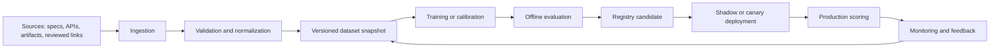

# ML Operations

This runbook defines how Tracera operates machine-learning-adjacent traceability
features: requirement mining, semantic matching, agreement scoring, visual
evidence scoring, quality analytics, and future learned scorers. Deterministic
heuristics remain the production baseline; learned models must prove measurable
value before promotion.

## Data Pipeline

Sources:

- Requirements, specs, and product notes from `docs/requirements/`, imported
  documents, and API payloads.
- Trace artifacts including code references, tests, risks, evidence captures,
  rationales, and graph nodes.
- Reviewed links from persistence tables, including `confidence`, `rationale`,
  artifact kind, project ID, and review metadata.
- Generated candidates from requirement mining and scoring services.

Validation:

- Preserve source provenance, project boundary, artifact kind, and extraction
  timestamp for every record.
- Reject records with missing identifiers, empty text, invalid confidence values,
  or cross-project joins.
- Keep human-reviewed labels separate from model-generated candidates.
- Sample rejected candidates for false-negative analysis instead of discarding all
  failed examples.

Versioning:

- Snapshot datasets before scorer, threshold, prompt, or embedding changes.
- Record dataset ID, schema version, source commit, extraction date, and label
  provenance with every evaluation.
- Treat redacted production snapshots as immutable evaluation inputs.

## Training

Model registry:

- Register every promoted scorer artifact with model name, scorer strategy,
  version, dataset ID, code commit, owner, training command, and rollback target.
- Store thresholds, embedding dimensions, prompts, tokenizer versions, and
  dependency versions with the artifact.
- Mark one production default per scoring task; keep older approved artifacts
  available for rollback.

Hyperparameter sweep:

- Sweep thresholds, retrieval depth, embedding model, batch size, prompt variant,
  and calibration method against the same frozen dataset.
- Optimize for precision and calibrated confidence before recall when false
  positives can corrupt trace integrity.
- Keep sweep output queryable: parameters, metrics, runtime, memory, and failure
  notes.

Reproducibility:

- Run training from pinned lockfiles and a recorded source commit.
- Seed stochastic libraries and log non-deterministic settings.
- Save raw config, processed config, dataset manifest, evaluation report, and
  artifact checksum.
- Keep optional ML imports lazy so non-ML Tracera installs still run.

## Evaluation

Offline metrics:

- Precision, recall, F1, false-positive rate, and false-negative rate.
- Confidence calibration by bucket, especially near promotion thresholds.
- Coverage lift for requirements with valid code, test, evidence, or risk links.
- Latency, memory, batch throughput, and model load time.
- Rationale quality samples for true positives, false positives, and false
  negatives.

Online A/B:

- Compare the candidate scorer against the deterministic baseline on equivalent
  traffic or review queues.
- Segment results by project, artifact kind, requirement class, and input source.
- Require enough volume to detect regression in high-confidence false positives
  before making the candidate default.

Guardrails:

- Do not auto-accept links below the configured confidence threshold.
- Block promotion if response schemas change for API, graph, or report consumers.
- Block promotion if latency, memory, or error rate exceeds service budgets.
- Preserve a human-readable `rationale` for every automated verdict.

## Deployment

Artifact promotion:

1. Register the candidate artifact and evaluation report.
2. Confirm owner approval, rollback target, and compatible schema.
3. Promote configuration, not callers: scorer selection should stay behind the
   scoring port or service boundary.

Canary:

- Enable the scorer for a narrow project, tenant, artifact kind, or review queue.
- Monitor accepted/rejected ratio, confidence distribution, latency, and reviewer
  overrides.
- Expand only when metrics match offline expectations.

Shadow:

- Run candidate scoring beside the production scorer without changing user-facing
  decisions.
- Log candidate outputs, disagreements, latency, and error details separately.
- Use shadow results to refresh offline datasets before canary.

Full rollout:

- Promote the scorer to production default after canary guardrails pass.
- Keep the previous scorer and threshold immediately restorable.
- Record rollout time, config diff, artifact checksum, and monitoring dashboard.

## Monitoring

Drift detection:

- Track input text length, artifact kind mix, project mix, language, label mix,
  embedding distribution, confidence histogram, and disagreement rate.
- Alert on sustained drift from the evaluation dataset or previous production
  window.

Latency:

- Measure p50, p95, and p99 scoring latency by scorer, task, and batch size.
- Track model load time separately from per-request scoring time.
- Alert when latency threatens API, import, or report-generation budgets.

Error rate:

- Track scoring exceptions, dependency import failures, model load failures,
  malformed outputs, schema validation failures, and timeout rates.
- Include candidate volume, accepted/rejected ratio, reviewer overrides, and
  rollback events in operational dashboards.

## Retraining

Triggers:

- Drift alerts, degraded precision or recall, rising reviewer override rate,
  new artifact types, new requirement formats, dependency upgrades, or model
  deprecation.
- Incident postmortems that identify missing labels, stale data, or poor
  calibration.

Schedule:

- Refresh evaluation snapshots at least monthly for active ML-backed scorers.
- Recalibrate thresholds after significant data-source changes.
- Run ad hoc retraining before major product launches or large tenant imports.

Data freshness:

- Include recently reviewed positives, reviewer-rejected false positives, and
  sampled false negatives.
- Exclude unresolved or unreviewed generated candidates from supervised labels.
- Verify freshness by source timestamp, extraction timestamp, and label review
  timestamp.

## Incident Response

Rollback:

- Restore the previous scorer name, artifact ID, threshold, and prompt/config.
- Disable auto-acceptance for affected tasks until confidence is restored.
- Preserve incident inputs and outputs for postmortem labeling.

Runbook:

1. Triage scope: affected scorer, projects, artifact kinds, release, and time
   window.
2. Stop expansion: pause canary or full rollout and pin the last known-good
   configuration.
3. Re-score a representative sample with the previous scorer and candidate.
4. Notify owners with impact, rollback status, and expected follow-up.
5. Add incident examples to the next evaluation snapshot after review.
6. Update registry notes, monitoring thresholds, and promotion criteria before
   retrying deployment.
